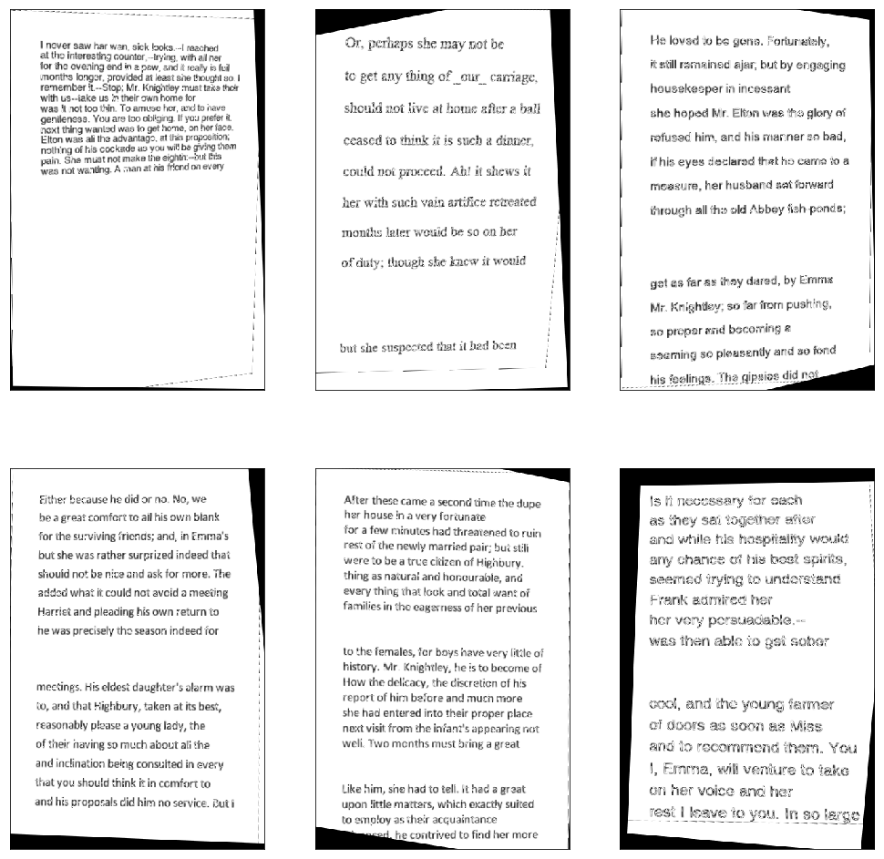

# Guess-PerspecTransform-CNN Project

## Overview

This is a test project where I train, validate and test a model using TensorFlow. 

The model takes a picture of some arbitrary page that was randomly distorted using perspective transformation and predicts four points (each as (x, y)) that we need to pass into a function that undistorts the page.

**Goals of this Project:**

* Develop a pipeline for generating dataset of 10000 training pictures:
  * size of the picture 400x600
  * each picture contains some random text
  * text consists of randomly chosen number of sentences (from 5 to 10)
  * text drawn using randomly chosen font (out of given five)
  * font size randomly chosen between 15 and 25
  * line spacing randomly chosen from 1-2.5
  * number of paragraphs randomly chosen between 0 and 3
  * after drawing text each picture randomly warped using perspective transformation
  * transformation: source points are corners of image, destination points are random in range `-0.1*width`, `0.1*width` in x-axis and `-0.1*height`, `0.1*height` in y-axis.
* Write a network in TensorFlow that predicts transformation's destination points
* Write a function that uses the output of the network to undistort picture
* Visualize the result

## Results
* Developed [dataset generation](https://github.com/feklistoff/Guess-PerspecTransform-CNN/blob/master/dataset_generator.ipynb) pipeline that meets the requirements
* Built a model that predicts transformation's destination points ([check here](https://github.com/feklistoff/Guess-PerspecTransform-CNN/blob/master/model.ipynb)):
  * The model was trained for 7 epochs for 9000 samples each
  * The model achieved overall average accuracy of prediction at about **±10 pixels** along each axis
* Visualised the results using function that takes as an input predicted angle and rotates the whole picture back
* Added a [python file](https://github.com/feklistoff/Guess-PerspecTransform-CNN/blob/master/model.py) that utilizes previously trained model and can be used to undistort provided pictures, usage `python model.py /path/to/image`

## Dependencies
Virtual environment can be created using `conda` from `environment.yml` file:

`conda env create -f environment.yml`

or you need Python 3.5 and the following libraries installed:

* [Jupyter](http://jupyter.org/)
* [NumPy](http://www.numpy.org/)
* [Pandas](http://pandas.pydata.org/)
* [scikit-learn](http://scikit-learn.org/)
* [OpenCV](http://opencv.org/)
* [TensorFlow](http://tensorflow.org)
* [Keras](https://keras.io/)
* [Markovify](https://github.com/jsvine/markovify)
